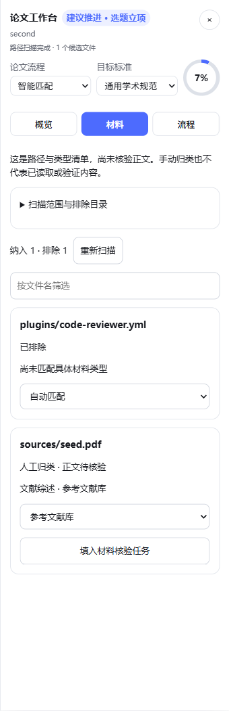
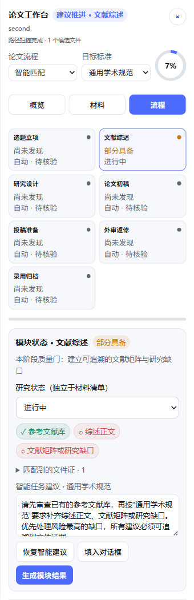

# 研序 · Research Loom

**让科研有序推进：从课题起步、文献整理，到论文写作、评审与投稿。**

Research Loom 是 [DeepSeek Harness（DSH）](https://github.com/deepseek-ai/deepseek-harness)
的学术科研插件。安装后，在 DSH 对话页打开右侧“论文工作台”，查看材料、推进模块任务，
并把研究背景传递到下一阶段。**不必记住斜杠命令。**

当前版本：**0.7.0** · 已验证宿主：**DSH 0.1.1-rc.2** · 许可：**CC-BY-NC-4.0（非商业）**

[快速安装](#快速安装) · [安装后是什么样](#安装后是什么样) · [第一次使用](#第一次使用) ·
[完整安装与排错](docs/INSTALL.zh-CN.md) · [后续计划](docs/ROADMAP.zh-CN.md) · [English](#english)

## 快速安装

先安装 [Node.js](https://nodejs.org/)（20 或以上，推荐当前 LTS）和 [Git](https://git-scm.com/downloads)。
打开终端：Windows 可用 PowerShell，macOS / Linux 可用系统终端。

```bash
# 检查环境
node --version
npm --version
git --version

# 安装当前验证过的 DeepSeek Harness
npm install -g @deepseek-ai/dsh@0.1.1-rc.2

# 从本仓库安装插件到 Web profile
dsh plugin --profile web add github:masskx/dsh-research-loom

# 启动，在浏览器中打开终端显示的地址
dsh web
```

已有兼容版本的 DSH，可以跳过安装 DSH 的那一步。普通使用者**不需要克隆仓库、安装 pnpm 或编译源码**；
仓库已经包含构建后的前端代码。

第一次运行 DSH，还需要按照 DSH 的引导配置可用的模型服务和凭据，并在对话中选择模型。
插件本身不提供 API Key 或模型额度。材料路径盘点不调用模型；生成研究结果会使用当前 DSH 模型和工具，
可能产生相应费用。联网检索和 PDF/DOCX 正文读取取决于宿主中可用的工具。

> 仓库名为 `dsh-research-loom`，内部插件包名暂时保留 `dsh-academic-research-skills`，
> 设置卡片仍显示 **Academic Research Skills**，以兼容已有安装。
> 本项目目前通过 GitHub 安装，不要用同名 npm 包代替本仓库版本。

## 安装后是什么样

在 DSH 中选择一个论文工作区，打开会话，便能看到“论文工作台”入口：

- 空白新会话：入口位于输入框上方，不必先发送消息。
- 已有对话：入口位于会话标题栏。
- 点击入口：在右侧展开工作台；点击 `×` 收起。桌面布局会为侧栏预留空间，极窄屏幕使用可关闭浮层。

工作台有三个视图，下面是 **0.7.0 真实组件在隔离演示项目中的截图**，不含私人论文。
截图展示界面和操作，不代表模型已经完成真实文献研究。

| 概览：下一步与课题起步 | 材料：归类与缺失依据 | 流程：模块与研究状态 |
| --- | --- | --- |
|  |  |  |

| 你想做什么 | 从哪里开始 | 能获得什么 |
| --- | --- | --- |
| 没有任何材料，开始新课题 | 概览 → 课题起步 → 在线检索资料 | 带时间窗、来源核验和研究方向比较要求的检索任务 |
| 已经收集了几篇论文 | 课题起步 → 整理已有资料 | 文献盘点、矩阵、创新点/局限综合及后续计划任务 |
| 基于现有论文补充最新进展 | 课题起步 → 已有资料 + 补充检索 | 先分析本地资料，再针对研究缺口检索、合并去重 |
| 看清论文缺少什么 | 材料 / 流程 | 路径匹配证据、已有/缺失材料，以及可纠正的归类 |
| 推进研究设计、初稿或返修 | 流程 → 选择模块 | 携带材料、研究背景和目标要求的可编辑任务建议 |
| 查看任务产物 | 概览 → 最近任务 | 执行状态、新增候选文件、人工验收入口 |
| 下次接着研究或换电脑 | 项目记忆 / 导出与导入 | 保留研究方向、关键结论、待解决问题和材料归类 |

这里的“生成任务”会把结构化提示提交到 DSH 对话；实际研究内容由所选模型和可用工具执行。
插件不会仅因发现一个文件，就声称它已读过全文或已通过学术质量审查。

## 第一次使用

1. 在 DSH 左侧添加论文所在文件夹作为工作区，进入该工作区的会话。
2. 打开“论文工作台”，到“材料”检查候选文件。目录里混有其他项目时，限定论文子目录或排除无关目录。
3. 选择论文流程：实证研究、理论研究、综述论文或自定义。实证流程会保留尚未产出数据的阶段。
4. 从“课题起步”开始，或到“流程”点开目前正在进行的模块。
5. 点击“填入对话框”检查和修改提示词，准备好后发送。也可点击“启动课题研究 / 生成模块结果”直接请求执行。
6. 执行后检查对话和产物。任务可以人工验收，阶段则在“研究状态”中独立确认。
7. 在“项目记忆”写下已确定方向和待解决问题；失焦后保存，后续模块任务会继承这些记录。

如果输入框已有草稿，插件会追加建议并留在输入框中，即使点击直接启动也不会自动发送这份已有草稿。

### 例子：从几篇论文开始

把已有论文放进工作区的 `sources/` 文件夹，选择“整理已有资料”，输入：

```text
研究主题：跨领域少样本分类
研究重点与约束：先比较现有方法的局限，优先考虑公开数据和可复现基线。
请给出候选方向，不要在证据不足时断言首次提出某种方法。
```

任务会要求模型读取相关材料、建立文献矩阵、比较研究缺口，并提出 3–5 个候选方向。
你确认方向后，将其记录到“项目记忆”，再进入“研究设计”，让下一模块沿用该背景。
系统提示要求保留原始论文，只创建衍生笔记或新版本；实际文件操作由 DSH 权限机制控制。

### 看懂状态和评分

| 显示项 | 含义 |
| --- | --- |
| 圆环“材料完整度” | 根据路径和文件类型计算的材料覆盖情况，不是论文质量或录用概率 |
| “材料齐全 / 部分具备 / 尚未发现” | 对预期材料类型的路径级判断，可以在“材料”里纠正 |
| 研究状态与流程进度条 | 由研究者确认的推进情况，自动扫描不会替你确认阶段 |
| “不适用” | 阶段不参与当前流程和评分，可在流程底部恢复 |
| 深度评分 | 将建议量表和材料交给模型，要求读材料、提供分项证据并标出无法评价项 |

SCI / EI 是快捷量表入口，并非统一的期刊或会议标准。在“概览 → 具体投稿目标与作者指南”
填写实际刊会、指南来源和日期，后续任务会携带这些要求。评价结果仍需研究者核验。

## 更新、停用与卸载

更新前停止正在运行的 `dsh web`，然后执行：

```bash
dsh plugin --profile web add github:masskx/dsh-research-loom --force
dsh web
```

暂时停用：到 **设置 → 插件 → 插件配置 → Academic Research Skills** 关闭开关。
技能、命令和工作台会即时隐藏，项目设置保留。

卸载：

```bash
dsh plugin --profile web remove dsh-academic-research-skills
```

卸载后重启 DSH。详细步骤、旧版迁移、远程服务器和常见问题见 [安装指南](docs/INSTALL.zh-CN.md)。

## 当前能力边界

- 自动盘点使用 DSH 文件索引的候选路径，不读取正文；人工归类也不等于全文核验。
- 默认过滤依赖、缓存和 JS/TS/YAML 配置文件。显式范围优先，支持手动纠正；单次最多保留 2,000 条候选路径，起步提示最多列出 60 条。
- 工作台直接启动的任务保留最近 20 项。执行状态随当前打开的会话观察，离开期间可在返回后复核。
- 产物回收检测新增路径，不检测原文件内容修改，也不能证明同期新增文件一定由该任务生成。纯对话结果请在对话中查看。
- 项目记忆按工作区路径保存在 DSH 设置中；跨电脑迁移使用 JSON 导出/导入，不自动同步项目文件。快照不含论文正文和会话任务历史。
- 联网检索、全文读取与生成质量取决于 DSH 模型和工具；本插件不附带独立 PDF/OCR 解析器或数据库订阅。
- 上游部分确定性核验脚本、Claude Code hooks 没有移植到本包。多角色技能描述不代表宿主一定并行启动多个代理。

## 开发与验证

```bash
git clone https://github.com/masskx/dsh-research-loom.git
cd dsh-research-loom
npm install -g pnpm@10
pnpm install --frozen-lockfile
pnpm run verify

# 将本地源码打包安装到 DSH Web profile
pnpm run install:local -- --profile web
dsh web
```

提交前运行 `pnpm run verify`，并提交构建后的 `lib/client.js` 和 `lib/client.js.map`，
保证 GitHub 安装者无需编译。`install:local` 使用带内容指纹的 tarball，适配 Windows 跨盘开发。

验证覆盖材料纠正、流程确认、任务状态、产物差集、记忆迁移等 15 项测试。
另有真实 DSH 界面检查和不调用模型的 [隔离浏览器验收流程](docs/QA.zh-CN.md)。
这些检查不代表真实在线研究或学术评估质量已被系统测量。

问题反馈请到 [Issues](https://github.com/masskx/dsh-research-loom/issues)，附操作系统、DSH/插件版本、
复现步骤和经过脱敏的日志。后续开发顺序与验收目标见 [Roadmap](docs/ROADMAP.zh-CN.md)。

## 来源与许可

本项目基于 [nullptr-DZF/dsh-academic-research-skills](https://github.com/nullptr-DZF/dsh-academic-research-skills)
二次开发；学术技能衍生自 Cheng-I Wu（[Imbad0202](https://github.com/Imbad0202)）的
[Academic Research Skills](https://github.com/Imbad0202/academic-research-skills) v3.21.1。

保留 4 个核心技能与 16 个 `/ars-*` 命令，在此基础上增加交互工作台、材料纠正、任务回流和项目记忆。
本仓库继续遵循 **CC-BY-NC-4.0**，要求署名并限制为非商业用途。这是公开源码项目，
不属于 OSI 定义的开源许可。完整说明见 [NOTICE](NOTICE.md) 和 [LICENSE](LICENSE)。

## English

**Research Loom** is an academic research workbench for DeepSeek Harness: start a
project, organize sources, inspect missing materials, run stage-specific tasks,
and carry research context into the next step. No slash-command memorization is required.

Install Node.js 20+ (current LTS recommended) and Git, then run:

```bash
npm install -g @deepseek-ai/dsh@0.1.1-rc.2
dsh plugin --profile web add github:masskx/dsh-research-loom
dsh web
```

Open the URL printed by DSH, configure a working model, select your paper workspace,
and open **Paper workbench**. Blank sessions show the launcher above the composer;
existing conversations show it in the header. The collapsible right panel offers
**Overview**, **Materials**, and **Workflow**. Screenshots above use synthetic demo data.

Version **0.7.0** is verified against DSH **0.1.1-rc.2**. The internal package name
remains `dsh-academic-research-skills`; the settings card is **Academic Research Skills**.
Use the GitHub source above, not an unrelated npm release. Model credentials and
usage costs are managed by DSH. Network search and document reading require suitable host tools.

Inventory is path-based, not evidence of reading or academic quality. Task tracking
observes the open session and collects new candidate paths, not edits to existing files.
Researcher confirmation is separate from material coverage. Portable memory uses
explicit JSON export/import. This project retains upstream attribution and is
licensed **CC-BY-NC-4.0**, for non-commercial use only.
